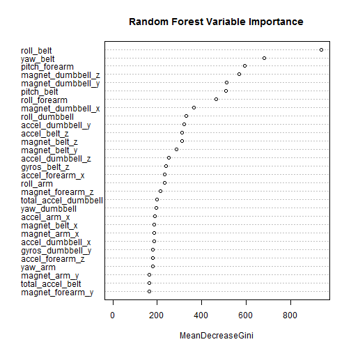

# Predicting Exercise Classification With Accelerometer Data
## Introduction
Using devices such as Jawbone Up, Nike FuelBand, and Fitbit it is now possible to collect a large amount of data about personal activity relatively inexpensively. This analysis uses accelerometer data collected by [Human Activity Recognition](http://groupware.les.inf.puc-rio.br/har) to predict the exercise classification of weight lifting exercises.
### Set options

```r
opts_chunk$set(message = FALSE, warning = FALSE)
```
### Load required libraries

```r
require(caret)
require(randomForest)
```
## Load the training and test data sets

```r
train.raw <- read.csv("data/pml-training.csv")
test.raw <- read.csv("data/pml-testing.csv")
```
## Data cleanup
The training data set has 19622 observations of 160 variables. Exploration of the data set shows that there are many columns with missing data (all columns with missing data total 19216 observations). These columns will be filtered from the training set. 

```r
train <- train.raw[, !sapply(train.raw, function(x) any(is.na(x)))]
```
In addition, columns with low or near zero variance are are removed as predictors using the nearZeroVar function in the Caret package.

```r
lowVar <- nearZeroVar(train)
train <- train[-lowVar]
```
Finally, the predictor columns are restricted to numeric types. User and timestamp related columns are removed, leaving only accelerometer observations and the exercise classification outcome. 

```r
train <- train[, sapply(train, function(x) is.numeric(x) | is.factor(x))]
remove_cols <-  c("X","user_name", "raw_timestamp_part_1", "raw_timestamp_part_2", "cvtd_timestamp",
                  "num_window")
train <- train[ , -which(names(train) %in% remove_cols)]
```
## Fit Model
First split the supplied training data into training and test sets for validation.

```r
set.seed(123)
inTraining <- createDataPartition(train$classe, p = 0.75, list = FALSE)
training <- train[inTraining, ]
testing <- train[-inTraining, ]
```
Build model using random forest to predict the outcome.

```r
modFit <- randomForest(classe ~ ., training, ntree=1000)
```
## Validation
Review the importance of the predictor variables for the fitted model:

```r
varImpPlot(modFit, sort = TRUE, main = "Random Forest Variable Importance")
```

 
Assess performance of the model on the test set using the confusionMatrix function.

```r
prediction <- predict(modFit, testing)
confusionMatrix(prediction, testing$classe)
```

```
## Confusion Matrix and Statistics
## 
##           Reference
## Prediction    A    B    C    D    E
##          A 1394    1    0    0    0
##          B    1  946    8    0    0
##          C    0    2  847    9    0
##          D    0    0    0  793    1
##          E    0    0    0    2  900
## 
## Overall Statistics
##                                         
##                Accuracy : 0.995         
##                  95% CI : (0.993, 0.997)
##     No Information Rate : 0.284         
##     P-Value [Acc > NIR] : <2e-16        
##                                         
##                   Kappa : 0.994         
##  Mcnemar's Test P-Value : NA            
## 
## Statistics by Class:
## 
##                      Class: A Class: B Class: C Class: D Class: E
## Sensitivity             0.999    0.997    0.991    0.986    0.999
## Specificity             1.000    0.998    0.997    1.000    1.000
## Pos Pred Value          0.999    0.991    0.987    0.999    0.998
## Neg Pred Value          1.000    0.999    0.998    0.997    1.000
## Prevalence              0.284    0.194    0.174    0.164    0.184
## Detection Rate          0.284    0.193    0.173    0.162    0.184
## Detection Prevalence    0.284    0.195    0.175    0.162    0.184
## Balanced Accuracy       0.999    0.997    0.994    0.993    0.999
```
The validation accuracy is 99.51% with an out-of-sample error of 0.49%. The 95% confidence interval lower bound indicates an expected 99.27% accuracy in predicting the exercise classification. 

## Predict the test data set values

```r
results <- predict(modFit, test.raw)

pml_write_files = function(x){
  n = length(x)
  for(i in 1:n){
    filename = paste0("problem_id_",i,".txt")
    write.table(x[i],file=filename,quote=FALSE,row.names=FALSE,col.names=FALSE)
  }
}

pml_write_files(results)
```
